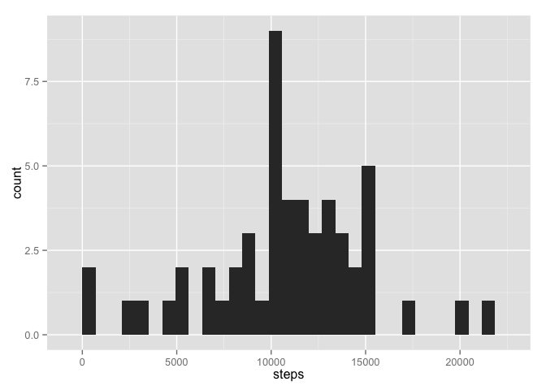
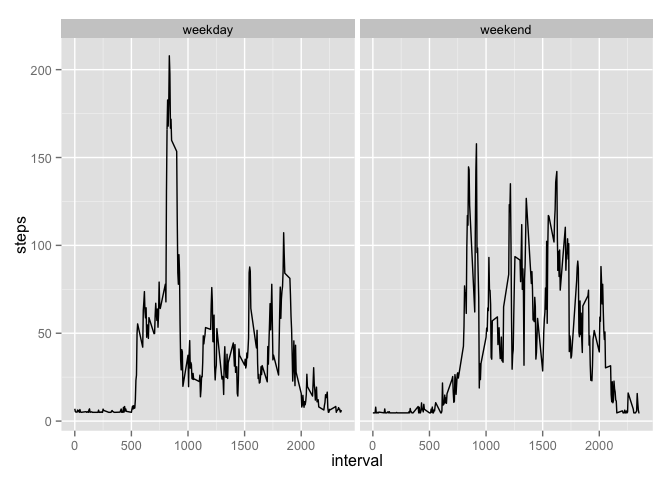

# Reproducible Research: Peer Assessment 1

```r
library(ggplot2)
```


## Loading and preprocessing the data

1. Load the data

```r
data<-read.csv("activity.csv")
```

Ignore the missing values in the dataset.

```r
data<-data[!is.na(data$steps),]
```

## What is mean total number of steps taken per day?

1. Calculate the total number of steps taken per day

```r
sumdata<-aggregate(steps ~ date, data = data, sum)
```

2. Make a histogram of the total number of steps taken each day

```r
qplot(steps, data = sumdata)
```

```
## stat_bin: binwidth defaulted to range/30. Use 'binwidth = x' to adjust this.
```

 

3. Calculate and report the mean and median of the total number of steps taken per day

The mean of total number of steps taken per day is 10766
The median of total number of steps taken per day is 10765

## What is the average daily activity pattern?

1. Make a time series plot (i.e. type = "l") of the 5-minute interval (x-axis) and the average number of steps taken, averaged across all days (y-axis)


```r
meaninterval <- aggregate(steps~interval,data = data,mean)
ggplot(meaninterval, aes(interval, steps)) + geom_line()
```

 

2. Which 5-minute interval, on average across all the days in the dataset, contains the maximum number of steps?


```r
meaninterval[which.max(meaninterval[,2]),]
```

```
##     interval    steps
## 104      835 206.1698
```

## Imputing missing values

1. Calculate and report the total number of missing values in the dataset (i.e. the total number of rows with NAs)


```r
nadata<-read.csv("activity.csv")
```

Total number of missing values is 2304`` 

2. Devise a strategy for filling in all of the missing values in the dataset. The strategy does not need to be sophisticated. For example, you could use the mean/median for that day, or the mean for that 5-minute interval, etc.

Filling in NA with overall mean steps per interval

3. Create a new dataset that is equal to the original dataset but with the missing data filled in.


```r
nadata$steps[is.na(nadata$steps)]<-mean(data$steps)
```

4. Make a histogram of the total number of steps taken each day and Calculate and report the mean and median total number of steps taken per day. Do these values differ from the estimates from the first part of the assignment? What is the impact of imputing missing data on the estimates of the total daily number of steps?


```r
sumnadata<-aggregate(steps ~ date, data = nadata, sum)
qplot(steps, data = sumnadata)
```

```
## stat_bin: binwidth defaulted to range/30. Use 'binwidth = x' to adjust this.
```

 

The mean of total number of steps taken per day is 10766
The median of total number of steps taken per day is 10766

The mean and median stays the same, as strategy was to fill in NAs with mean (and median is similar, which is now even more likely to be the mean given the size of the dataset). However, the distribution, while similar, is amplified. One can see the increase on the y-axis in counts. 

## Are there differences in activity patterns between weekdays and weekends?

1.Create a new factor variable in the dataset with two levels – “weekday” and “weekend” indicating whether a given date is a weekday or weekend day.


```r
nadata$weekdays<-weekdays(as.Date(nadata$date, format="%Y-%m-%d"))
nadata$weekdays[nadata$weekdays %in% c("Monday","Tuesday","Wednesday","Thursday","Friday")]<-"weekday"
nadata$weekdays[nadata$weekdays %in% c("Saturday","Sunday")]<-"weekend"
```

Make a panel plot containing a time series plot (i.e. type = "l") of the 5-minute interval (x-axis) and the average number of steps taken, averaged across all weekday days or weekend days (y-axis)


```r
meannainterval <- aggregate(steps~interval+weekdays,data = nadata,mean)
ggplot(meannainterval, aes(interval, steps)) + geom_line()+facet_wrap(~weekdays,ncol = 2)
```

 

